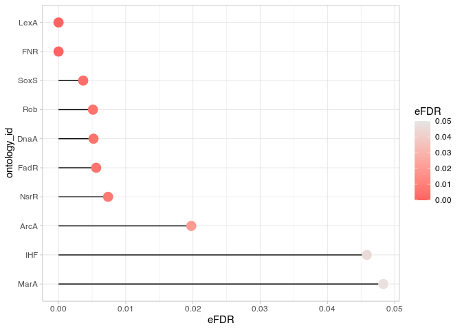
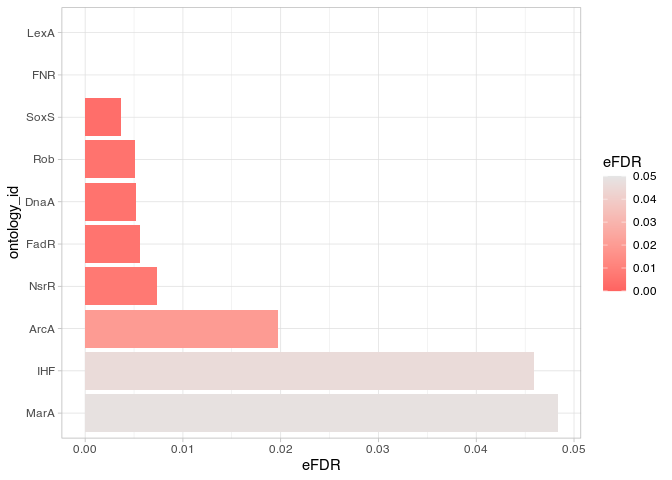
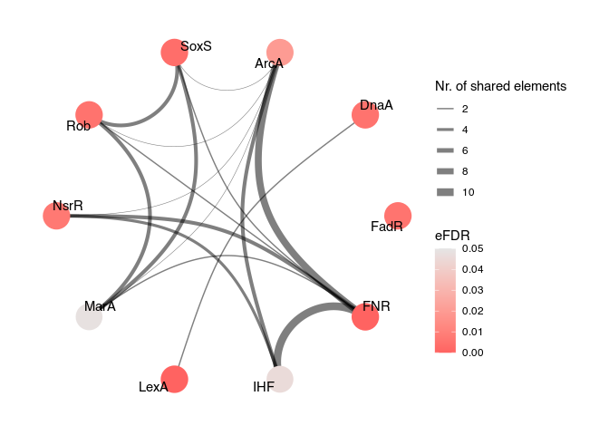
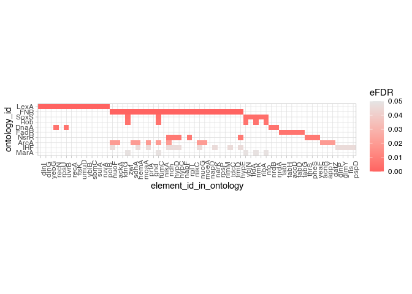
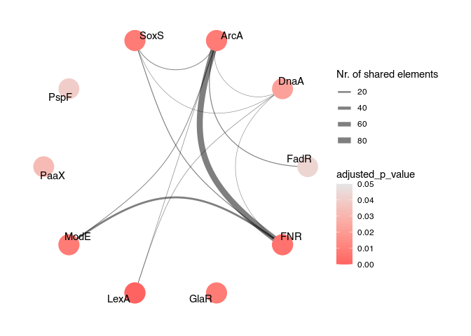

#  `mulea` - an R Package for Enrichment Analysis Using Multiple Ontologies and Empirical False Discovery Rate

- [Introduction](#introduction)
- [Installation](#installation)
- [Usage](#usage)
  - [Importing the Ontology](#importing-the-ontology)
  - [The Differential Expression Dataset to
    Analyse](#the-differential-expression-dataset-to-analyse)
  - [The Unordered Set-Based Overrepresentation Analysis
    (ORA)](#the-unordered-set-based-overrepresentation-analysis-ora)
  - [Gene Set Enrichment Analysis
    (GSEA)](#gene-set-enrichment-analysis-gsea)
  - [Formatting the Results of a Differential Expression
    Analysis](#formatting-the-results-of-a-differential-expression-analysis)
- [Session Info](#session-info)
- [How to Cite the `mulea` Package?](#how-to-cite-the-mulea-package)
- [References](#references)

<!-- badges: start -->

[](https://github.com/ELTEbioinformatics/mulea/issues)
[](https://github.com/ELTEbioinformatics/mulea/pulls)

<!-- badges: end -->

# Introduction

The `mulea` R package (Turek et al. 2024) is a comprehensive tool for
functional enrichment analysis. It provides two different approaches:

1.  For unranked sets of elements, such as significantly up- or
    down-regulated genes, `mulea` employs the set-based
    **overrepresentation analysis (ORA)**.

2.  Alternatively, if the data consists of ranked elements, for
    instance, genes ordered by *p*-value or log fold-change calculated
    by the differential expression analysis, `mulea` offers the **gene
    set enrichment (GSEA)** approach.

For the overrepresentation analysis, `mulea` employs a progressive
**empirical false discovery rate (eFDR)** method, specifically designed
for interconnected biological data, to accurately identify significant
terms within diverse ontologies.

`mulea` expands beyond traditional tools by incorporating a **wide range
of ontologies**, encompassing Gene Ontology, pathways, regulatory
elements, genomic locations, and protein domains for 27 model organisms,
covering 22 ontology types from 16 databases and various identifiers
resulting in 879 files available at the
[ELTEbioinformatics/GMT_files_for_mulea](https://github.com/ELTEbioinformatics/GMT_files_for_mulea)
GitHub repository and through the
[`muleaData`](https://bioconductor.org/packages/release/data/experiment/html/muleaData.html)
ExperimentData Bioconductor package.

# Installation

Install the dependency `fgsea` BioConductor package:

``` r
# Installing the BiocManager package if needed
if (!require("BiocManager", quietly = TRUE))
    install.packages("BiocManager")
# Installing the fgsea package with the BiocManager
BiocManager::install("fgsea")
```

To install `mulea` from
[CRAN](https://cran.r-project.org/package=mulea):

``` r
install.packages("mulea")
```

To install the development version of `mulea` from GitHub:

``` r
# Installing the devtools package if needed
if (!require("devtools", quietly = TRUE))
    install.packages("devtools")

# Installing the mulea package from GitHub
devtools::install_github("https://github.com/ELTEbioinformatics/mulea")
```

# Usage

First, load the **`mulea`** and **`dplyr`** libraries. The **`dplyr`**
library is not essential but is used here to facilitate data
manipulation and inspection.

``` r
library(mulea)
library(tidyverse)
```

## Importing the Ontology

This section demonstrates how to import the desired ontology, such as
transcription factors and their target genes downloaded from the
 [database](https://regulondb.ccg.unam.mx/), into a data
frame suitable for enrichment analysis. We present multiple methods for
importing the ontology. Ensure that the identifier type (*e.g.*,
*UniProt* protein ID, *Entrez* ID, Gene Symbol, *Ensembl* gene ID)
matches between the ontology and the elements you wish to investigate.

### Alternative 1: Importing the Ontology from a GMT File

The [GMT (Gene Matrix
Transposed)](https://software.broadinstitute.org/cancer/software/gsea/wiki/index.php/Data_formats#GMT:_Gene_Matrix_Transposed_file_format_.28.2A.gmt.29)
format contains collections of genes or proteins associated with
specific ontology terms in a tab-delimited text file. The GMT file can
be read into R as a data frame using the `read_gmt` function from the
`mulea` package. Each term is represented by a single row in both the
GMT file and the data frame. Each row includes three types of elements:

1.  **Ontology identifier** (“*ontology_id*”): This uniquely identifies
    each term within the file or data frame.

2.  **Ontology name or description** (*“ontology_name”*): This provides
    a user-friendly label or textual description for each term.

3.  **Associated gene or protein identifiers**: These are listed in the
    *“list_of_values”* column, with identifiers separated by spaces, and
    belong to each term.[^1]

#### A) `mulea` GMT File

Alongside with the `mulea` package we provide ontologies collected from
16 publicly available databases, in a standardised GMT format for 27
model organisms, from Bacteria to human. These files are available at
the
[ELTEbioinformatics/GMT_files_for_mulea](https://github.com/ELTEbioinformatics/GMT_files_for_mulea)
GitHub repository.

To read a downloaded GMT file locally:

``` r
# Reading the mulea GMT file locally
tf_ontology <- read_gmt("Transcription_factor_RegulonDB_Escherichia_coli_GeneSymbol.gmt")
```

Alternatively, one can read it directly from the GitHub repository:

``` r
# Reading the GMT file from the GitHub repository
tf_ontology <- read_gmt("https://raw.githubusercontent.com/ELTEbioinformatics/GMT_files_for_mulea/main/GMT_files/Escherichia_coli_83333/Transcription_factor_RegulonDB_Escherichia_coli_GeneSymbol.gmt")
```

#### B) Enrichr GMT File

`mulea` is compatible with [GMT
files](https://maayanlab.cloud/Enrichr/#libraries) provided with the
`Enricher` R package (Kuleshov et al. 2016). Download and read such a
GMT file (*e. g.* <u>TRRUST_Transcription_Factors_2019.txt</u>) locally.
*Note that this ontology is not suitable for analyzing the Escherichia
coli differential expression data described in the section [The
Differential Expression Dataset to
Analyse](#the-differential-expression-dataset-to-analyse).*

``` r
# Reading the Enrichr GMT file locally
tf_enrichr_ontology <- read_gmt("TRRUST_Transcription_Factors_2019.txt")

# The ontology_name is empty, therefore we need to fill it with the ontology_id
tf_enrichr_ontology$ontology_name <- tf_enrichr_ontology$ontology_id
```

#### C) MsigDB GMT File

`mulea` is compatible with the MsigDB (Subramanian et al. 2005) [GMT
files](https://www.gsea-msigdb.org/gsea/msigdb/). Download and read such
a GMT file (*e. g.* <u>c3.tft.v2023.2.Hs.symbols.gmt</u>) locally. *Note
that this ontology is not suitable for analyzing the Escherichia coli
differential expression data described in the section [The Differential
Expression Dataset to
Analyse](#the-differential-expression-dataset-to-analyse).*

``` r
# Reading the MsigDB GMT file locally
tf_msigdb_ontology <- read_gmt("c3.tft.v2023.2.Hs.symbols.gmt")
```

### Alternative 2: Importing the Ontology with the `muleaData` Package

Alternatively, you can retrieve the ontology using the
[`muleaData`](https://github.com/ELTEbioinformatics/muleaData)
ExperimentData Bioconductor package:

``` r
# Installing the ExperimentHub package from Bioconductor
BiocManager::install("ExperimentHub")

# Calling the ExperimentHub library.
library(ExperimentHub)

# Downloading the metadata from ExperimentHub.
eh <- ExperimentHub()

# Creating the muleaData variable.
muleaData <- query(eh, "muleaData")

# Looking for the ExperimentalHub ID of the ontology.
EHID <- mcols(muleaData) %>% 
  as.data.frame() %>% 
  dplyr::filter(title == "Transcription_factor_RegulonDB_Escherichia_coli_GeneSymbol.rds") %>% 
  rownames()

# Reading the ontology from the muleaData package.
tf_ontology <- muleaData[[EHID]]

# Change the header
tf_ontology <- tf_ontology %>% 
  rename(ontology_id = "ontologyId",
         ontology_name = "ontologyName",
         list_of_values = "listOfValues")
```

### Filtering the Ontology

Enrichment analysis results can sometimes be skewed by overly specific
or broad entries. `mulea` allows you to customise the size of ontology
entries – the number of genes or proteins belonging to a term – ensuring
your analysis aligns with your desired scope.

Let’s exclude ontology entries with less than 3 or more than 400 gene
symbols.

``` r
# Filtering the ontology
tf_ontology_filtered <- filter_ontology(gmt = tf_ontology,
                                        min_nr_of_elements = 3,
                                        max_nr_of_elements = 400)
```

### Saving the Ontology as a GMT file

You can save the ontology as a GMT file using the **`write_gmt`**
function.

``` r
# Saving the ontology to GMT file
write_gmt(gmt = tf_ontology_filtered, 
          file = "Filtered.gmt")
```

### Converting a List to an Ontology Object

The `mulea` package provides the `list_to_gmt` function to convert a
list of gene sets into an ontology data frame. The following example
demonstrates how to use this function:

``` r
# Creating a list of gene sets
ontology_list <- list(gene_set1 = c("gene1", "gene2", "gene3"),
                      gene_set2 = c("gene4", "gene5", "gene6"))

# Converting the list to a ontology (GMT) object
new_ontology_df <- list_to_gmt(ontology_list)
```

## The Differential Expression Dataset to Analyse

For further steps we will analyse a dataset from a microarray experiment
([GSE55662](https://www.ncbi.nlm.nih.gov/geo/query/acc.cgi?acc=GSE55662))
in the NCBI Gene Expression Omnibus
. The study by
Méhi et al. (2014) investigated antibiotic resistance evolution in
*Escherichia coli*. Gene expression changes were compared between
*ciprofloxacin* antibiotic-treated *Escherichia coli* bacteria and
non-treated controls.

The expression levels of these groups were compared with the
[GEO2R](https://www.ncbi.nlm.nih.gov/geo/geo2r/?acc=GSE55662) tool:

- Non-treated control samples (2 replicates):
  [WT_noCPR_1](https://www.ncbi.nlm.nih.gov/geo/query/acc.cgi?acc=GSM1341344),
  [WT_noCPR_2](https://www.ncbi.nlm.nih.gov/geo/query/acc.cgi?acc=GSM1341345)
- *Ciprofloxacin*-treated samples (2 replicates):
  [WT_CPR_1](https://www.ncbi.nlm.nih.gov/geo/query/acc.cgi?acc=GSM1341346),
  [WT_CPR_2](https://www.ncbi.nlm.nih.gov/geo/query/acc.cgi?acc=GSM1341347)

To see how the dataset were prepared go to the [Formatting the Results
of a Differential Expression
Analysis](#formatting-the-results-of-a-differential-expression-analysis)
section.

## The Unordered Set-Based Overrepresentation Analysis (ORA)

The `mulea` package implements a set-based enrichment analysis approach
using the *hypergeometric test*, which is analogous to the one-tailed
Fisher’s exact test. This method identifies statistically significant
overrepresentation of elements from a target set (*e.g.*, significantly
up- or downregulated genes) within a background set (*e.g.*, all genes
that were investigated in the experiment). Therefore, a predefined
threshold value, such as 0.05 for the corrected *p*-value or 2-fold
change, should be used in the preceding analysis.

The overrepresentation analysis is implemented in the `ora` function
which requires three inputs:

1.  **Ontology** **data frame:** Fits the investigated taxa and the
    applied gene or protein identifier type, such as GO, pathway,
    transcription factor regulation, microRNA regulation, gene
    expression data, genomic location data, or protein domain content.

2.  **Target set:** A vector of elements to investigate, containing
    genes or proteins of interest, such as significantly overexpressed
    genes in the experiment.

3.  **Background set:** A vector of background elements representing the
    broader context, often including all genes investigated in the
    study.

### Reading the Target and the Background Sets from Text Files

Let’s read the text files containing the identifiers (gene symbols) of
the target and the background gene set directly from the GitHub website.
To see how these files were prepared, refer to the section on
[Formatting the Results of a Differential Expression
Analysis](#formatting-the-results-of-a-differential-expression-analysis).

``` r
# Taget set
target_set <- readLines("https://raw.githubusercontent.com/ELTEbioinformatics/mulea/master/inst/extdata/target_set.txt")

# Background set
background_set  <- readLines("https://raw.githubusercontent.com/ELTEbioinformatics/mulea/master/inst/extdata/background_set.txt")
```

### Performing the OverRepresentation Analysis

To perform the analysis, we will first establish a model using the `ora`
function. This model defines the parameters for the enrichment analysis.
We then execute the test itself using the **`run_test`** function. It is
important to note that for this example, we will employ 10,000
permutations for the *empirical false discovery rate* (*eFDR*), which is
the recommended minimum, to ensure robust correction for multiple
testing.

``` r
# Creating the ORA model using the GMT variable
ora_model <- ora(gmt = tf_ontology_filtered, 
                 # Test set variable
                 element_names = target_set, 
                 # Background set variable
                 background_element_names = background_set, 
                 # p-value adjustment method
                 p_value_adjustment_method = "eFDR", 
                 # Number of permutations
                 number_of_permutations = 10000,
                 # Number of processor threads to use
                 nthreads = 2, 
                 # Setting a random seed for reproducibility
                 random_seed = 1) 

# Running the ORA
ora_results <- run_test(ora_model)
```

### Examining the ORA Result

The `ora_results` data frame summarises the enrichment analysis, listing
enriched ontology entries – in our case transcription factors –
alongside their associated *p*-values and *eFDR* values.

We can now determine the number of transcription factors classified as
“enriched” based on these statistical measures (*eFDR* \< 0.05).

``` r
ora_results %>%
  # Rows where the eFDR < 0.05
  filter(eFDR < 0.05) %>% 
  # Number of such rows
  nrow()
#> [1] 10
```

Inspect the significant results:

``` r
ora_results %>%
  # Arrange the rows by the eFDR values
  arrange(eFDR) %>% 
  # Rows where the eFDR < 0.05
  filter(eFDR < 0.05)
```

| ontology_id | ontology_name | nr_common_with_tested_elements | nr_common_with_background_elements | p_value | eFDR |
|:---|:---|---:|---:|---:|---:|
| FNR | FNR | 26 | 259 | 0.0000003 | 0.0000000 |
| LexA | LexA | 14 | 53 | 0.0000000 | 0.0000000 |
| SoxS | SoxS | 7 | 37 | 0.0001615 | 0.0036667 |
| Rob | Rob | 5 | 21 | 0.0004717 | 0.0051200 |
| DnaA | DnaA | 4 | 13 | 0.0006281 | 0.0052000 |
| FadR | FadR | 5 | 20 | 0.0003692 | 0.0056000 |
| NsrR | NsrR | 8 | 64 | 0.0010478 | 0.0073714 |
| ArcA | ArcA | 12 | 148 | 0.0032001 | 0.0197500 |
| IHF | IHF | 14 | 205 | 0.0070758 | 0.0458600 |
| MarA | MarA | 5 | 37 | 0.0066068 | 0.0483111 |

### Visualising the ORA Result

To gain a comprehensive understanding of the enriched transcription
factors, **`mulea`** offers diverse visualisation tools, including
lollipop charts, bar plots, networks, and heatmaps. These visualisations
effectively reveal patterns and relationships among the enriched
factors.

Initialising the visualisation with the `reshape_results` function:

``` r
# Reshapeing the ORA results for visualisation
ora_reshaped_results <- reshape_results(model = ora_model, 
                                        model_results = ora_results, 
                                        # Choosing which column to use for the
                                        #     indication of significance
                                        p_value_type_colname = "eFDR")
```

**Visualising the Spread of *eFDR* Values: Lollipop Plot**

Lollipop charts provide a graphical representation of the distribution
of enriched transcription factors. The *y*-axis displays the
transcription factors, while the *x*-axis represents their corresponding
*eFDR* values. The dots are coloured based on their *eFDR* values. This
visualisation helps us examine the spread of *eFDRs* and identify
factors exceeding the commonly used significance threshold of 0.05.

``` r
plot_lollipop(reshaped_results = ora_reshaped_results,
              # Column containing the names we wish to plot
              ontology_id_colname = "ontology_id",
              # Upper threshold for the value indicating the significance
              p_value_max_threshold = 0.05,
              # Column that indicates the significance values
              p_value_type_colname = "eFDR")
```



**Visualising the Spread of *eFDR* Values: Bar Plot**

Bar charts offer a graphical representation similar to lollipop plots.
The *y*-axis displays the enriched ontology categories (*e.g.*,
transcription factors), while the *x*-axis represents their
corresponding *eFDR* values. The bars are coloured based on their *eFDR*
values, aiding in examining the spread of *eFDRs* and identifying
factors exceeding the significance threshold of 0.05.

``` r
plot_barplot(reshaped_results = ora_reshaped_results,
              # Column containing the names we wish to plot
              ontology_id_colname = "ontology_id",
              # Upper threshold for the value indicating the significance
              p_value_max_threshold = 0.05,
              # Column that indicates the significance values
              p_value_type_colname = "eFDR")
```



**Visualising the Associations: Graph Plot**

This function generates a network visualisation of the enriched ontology
categories (*e.g.*, transcription factors). Each node represents an
eriched ontology category, coloured based on its *eFDR* value. An edge
is drawn between two nodes if they share at least one common gene
belonging to the target set, indicating co-regulation. The thickness of
the edge reflects the number of shared genes.

``` r
plot_graph(reshaped_results = ora_reshaped_results,
           # Column containing the names we wish to plot
           ontology_id_colname = "ontology_id",
           # Upper threshold for the value indicating the significance
           p_value_max_threshold = 0.05,
           # Column that indicates the significance values
           p_value_type_colname = "eFDR")
```



**Visualising the Associations: Heatmap**

The heatmap displays the genes associated with the enriched ontology
categories (*e.g.*, transcription factors). Each row represents a
category, coloured based on its *eFDR* value. Each column represents a
gene from the target set belonging to the enriched ontology category,
indicating potential regulation by one or more enriched transcription
factors.

``` r
plot_heatmap(reshaped_results = ora_reshaped_results,
             # Column containing the names we wish to plot
             ontology_id_colname = "ontology_id",
             # Column that indicates the significance values
             p_value_type_colname = "eFDR")
```



### Comparing the significant results when applying the eFDR to the Benjamini-Hochberg and the Bonferroni corrections

The `ora` function allows you to choose between different methods for
calculating the *FDR* and adjusting the *p*-values: *eFDR*, and all
`method` options from the `stats::p.adjust` documentation (holm,
hochberg, hommel, bonferroni, BH, BY, and fdr). The following code
snippet demonstrates how to perform the analysis using the
*Benjamini-Hochberg* and *Bonferroni* corrections:

``` r
# Creating the ORA model using the Benjamini-Hochberg p-value correction method
BH_ora_model <- ora(gmt = tf_ontology_filtered, 
                 # Test set variable
                 element_names = target_set, 
                 # Background set variable
                 background_element_names = background_set, 
                 # p-value adjustment method
                 p_value_adjustment_method = "BH") 

# Running the ORA
BH_results <- run_test(BH_ora_model)

# Creating the ORA model using the Bonferroni p-value correction method
Bonferroni_ora_model <- ora(gmt = tf_ontology_filtered, 
                            # Test set variable
                            element_names = target_set, 
                            # Background set variable
                            background_element_names = background_set, 
                            # p-value adjustment method
                            p_value_adjustment_method = "bonferroni") 

# Running the ORA
Bonferroni_results <- run_test(Bonferroni_ora_model)
```

To compare the significant results (using the conventional \< 0.05
threshold) of the *eFDR*, *Benjamini-Hochberg*, and *Bonferroni*
corrections, we can merge and filter the result tables:

``` r
# Merging the Benjamini-Hochberg and eFDR results
merged_results <- BH_results %>% 
  # Renaming the column
  rename(BH_adjusted_p_value = adjusted_p_value) %>% 
  # Selecting the necessary columns
  select(ontology_id, BH_adjusted_p_value) %>%
  # Joining with the eFDR results
  left_join(ora_results, ., by = "ontology_id") %>% 
  # Converting the data.frame to a tibble
  tibble()

# Merging the Bonferroni results with the merged results
merged_results <- Bonferroni_results %>% 
  # Renaming the column
  rename(Bonferroni_adjusted_p_value = adjusted_p_value) %>% 
  # Selecting the necessary columns
  select(ontology_id, Bonferroni_adjusted_p_value) %>%
  # Joining with the eFDR results
  left_join(merged_results, ., by = "ontology_id") %>% 
  # Arranging by the p-value
  arrange(p_value)

# filter the p-value < 0.05 results
merged_results_filtered <- merged_results %>% 
  filter(p_value < 0.05) %>% 
  # remove the unnecessary columns
  select(-ontology_id, -nr_common_with_tested_elements, 
         -nr_common_with_background_elements)
```

| ontology_name | p_value | eFDR | BH_adjusted_p_value | Bonferroni_adjusted_p_value |
|:---|---:|---:|---:|---:|
| LexA | 0.0000000 | 0.0000000 | 0.0000001 | 0.0000001 |
| FNR | 0.0000003 | 0.0000000 | 0.0000208 | 0.0000416 |
| SoxS | 0.0001615 | 0.0036667 | 0.0082880 | 0.0248641 |
| FadR | 0.0003692 | 0.0056000 | 0.0142127 | 0.0568507 |
| Rob | 0.0004717 | 0.0051200 | 0.0145296 | 0.0726479 |
| DnaA | 0.0006281 | 0.0052000 | 0.0161218 | 0.0967306 |
| NsrR | 0.0010478 | 0.0073714 | 0.0230517 | 0.1613622 |
| ArcA | 0.0032001 | 0.0197500 | 0.0616014 | 0.4928114 |
| MarA | 0.0066068 | 0.0483111 | 0.1089670 | 1.0000000 |
| IHF | 0.0070758 | 0.0458600 | 0.1089670 | 1.0000000 |
| NarL | 0.0096065 | 0.0534000 | 0.1276532 | 1.0000000 |
| NikR | 0.0099470 | 0.0615833 | 0.1276532 | 1.0000000 |
| OxyR | 0.0174505 | 0.0786923 | 0.2067212 | 1.0000000 |
| ExuR | 0.0261046 | 0.1051867 | 0.2680073 | 1.0000000 |
| UxuR | 0.0261046 | 0.1051867 | 0.2680073 | 1.0000000 |
| NrdR | 0.0328500 | 0.1232750 | 0.3161817 | 1.0000000 |
| IscR | 0.0376038 | 0.1249412 | 0.3406459 | 1.0000000 |
| Nac | 0.0419701 | 0.1487556 | 0.3590774 | 1.0000000 |
| Fis | 0.0457307 | 0.1433053 | 0.3706596 | 1.0000000 |

A comparison of the significant results revealed that conventional
*p*-value corrections (Benjamini-Hochberg and Bonferroni) tend to be
overly conservative, leading to a reduction in the number of significant
transcription factors compared to the *eFDR*. As illustrated in the
below figure, by applying the *eFDR* we were able to identify 10
significant transcription factors, while with the Benjamini-Hochberg and
Bonferroni corrections only 7 and 3, respectively. This suggests that
the *eFDR* may be a more suitable approach for controlling false
positives in this context.


## Gene Set Enrichment Analysis (GSEA)

To perform enrichment analysis using ranked lists, you need to provide
an ordered list of elements, such as genes or proteins. This ranking is
typically based on the results of your prior analysis, using metrics
like *p*-values, *z*-scores, fold-changes, or others. Crucially, the
ranked list should include all elements involved in your analysis. For
example, in a differential expression study, it should encompass all
genes that were measured.

`mulea` utilises the Kolmogorov-Smirnov approach with a permutation test
(developed by Subramanian et al. (2005)) to calculate gene set
enrichment analyses. This functionality is implemented through the
integration of the
[`fgsea`](https://bioconductor.org/packages/release/bioc/html/fgsea.html)
Bioconductor package (created by Korotkevich et al. (2021)).

GSEA requires input data about the genes analysed in our experiment.
This data can be formatted in two ways:

1.  **Data frame:** This format should include all genes investigated
    and their respective log fold change values (or other values for
    ordering the genes) obtained from the differential expression
    analysis.

2.  **Two vectors:** Alternatively, you can provide two separate
    vectors. One vector should contain the gene symbols (or IDs), and
    the other should hold the corresponding log fold change values (or
    other values for ordering the genes) for each gene.

### Reading the Tab Delimited File Containing the Ordered Set

Let’s read the TSV file containing the identifiers (gene symbols) and
the log fold change values of the investigated set directly from the
GitHub website. For details on how this file was prepared, please refer
to the [Formatting the Results of a Differential Expression
Analysis](#formatting-the-results-of-a-differential-expression-analysis)
section.

``` r
# Reading the tsv containing the ordered set
ordered_set <- read_tsv("https://raw.githubusercontent.com/ELTEbioinformatics/mulea/master/inst/extdata/ordered_set.tsv")
```

### Performing the Gene Set Enrichment Analysis

To perform the analysis, we will first establish a model using the
`gsea` function. This model defines the parameters for the enrichment
analysis. Subsequently, we will execute the test itself using the
`run_test` function. We will employ 10,000 permutations for the false
discovery rate, to ensure robust correction for multiple testing.

``` r
# Creating the GSEA model using the GMT variable
gsea_model <- gsea(gmt = tf_ontology_filtered,
                   # Names of elements to test
                   element_names = ordered_set$Gene.symbol,
                   # LogFC-s of elements to test
                   element_scores = ordered_set$logFC,
                   # Consider elements having positive logFC values only
                   element_score_type = "pos",
                   # Number of permutations
                   number_of_permutations = 10000)

# Running the GSEA
gsea_results <- run_test(gsea_model)
```

### Examining the GSEA Results

The `gsea_results` data frame summarises the enrichment analysis,
listing enriched ontology entries – in our case transcription factors –
alongside their associated *p*-values and adjusted *p*-value values.

We can now determine the number of transcription factors classified as
“enriched” based on these statistical measures (adjusted *p*-value \<
0.05).

``` r
gsea_results %>%
  # rows where the adjusted_p_value < 0.05
  filter(adjusted_p_value < 0.05) %>% 
  # the number of such rows
  nrow()
#> [1] 10
```

Inspect the significant results:

``` r
gsea_results %>%
  # arrange the rows by the adjusted_p_value values
  arrange(adjusted_p_value) %>% 
  # rows where the adjusted_p_value < 0.05
  filter(adjusted_p_value < 0.05)
```

| ontology_id | ontology_name | nr_common_with_tested_elements | p_value | adjusted_p_value |
|:---|:---|---:|---:|---:|
| LexA | LexA | 53 | 0.0000000 | 0.0000047 |
| FNR | FNR | 259 | 0.0000660 | 0.0050484 |
| ArcA | ArcA | 148 | 0.0003076 | 0.0079598 |
| GlaR | GlaR | 3 | 0.0002188 | 0.0079598 |
| ModE | ModE | 45 | 0.0003122 | 0.0079598 |
| SoxS | SoxS | 37 | 0.0002848 | 0.0079598 |
| DnaA | DnaA | 13 | 0.0010217 | 0.0223306 |
| PaaX | PaaX | 14 | 0.0017028 | 0.0325652 |
| PspF | PspF | 7 | 0.0023494 | 0.0399397 |
| FadR | FadR | 20 | 0.0028304 | 0.0433046 |

### Visualising the GSEA Results

Initializing the visualisation with the `reshape_results` function:

``` r
# Reshaping the GSEA results for visualisation
gsea_reshaped_results <- reshape_results(model = gsea_model, 
                                         model_results = gsea_results, 
                                         # choosing which column to use for the
                                         # indication of significance
                                         p_value_type_colname = "adjusted_p_value")
```

**Visualising Relationships: Graph Plot**

This function generates a network visualisation of the enriched ontology
categories (*e.g.*, transcription factors). Each node represents a
category and is coloured based on its significance level. A connection
(edge) is drawn between two nodes if they share at least one common gene
belonging to the **ranked list**, meaning that both transcription
factors regulate the expression of the same target gene. The thickness
of the edge reflects the number of shared genes.

``` r
plot_graph(reshaped_results = gsea_reshaped_results,
           # the column containing the names we wish to plot
           ontology_id_colname = "ontology_id",
           # upper threshold for the value indicating the significance
           p_value_max_threshold = 0.05,
           # column that indicates the significance values
           p_value_type_colname = "adjusted_p_value")
```



Other plot types such as lollipop plots, bar plots, and heatmaps can
also be used to investigate the GSEA results.

## Formatting the Results of a Differential Expression Analysis

### **Understanding the Differential Expression Results Table**

This section aims to elucidate the structure and essential components of
the provided DE results table. It offers guidance to users on
interpreting the data effectively for subsequent analysis with `mulea`.

Let’s read the differential expression result file named
[GSE55662.table_wt_non_vs_cipro.tsv](https://github.com/ELTEbioinformatics/mulea/blob/master/inst/extdata/GSE55662.table_wt_non_vs_cipro.tsv)
located in the
[inst/extdata/](https://github.com/ELTEbioinformatics/mulea/tree/master/inst/extdata)
folder directly from the GitHub website.

``` r
# Importing necessary libraries and reading the DE results table
geo2r_result_tab <- read_tsv("https://raw.githubusercontent.com/ELTEbioinformatics/mulea/master/inst/extdata/GSE55662.table_wt_non_vs_cipro.tsv")
```

Let’s delve into the `geo2r_result_tab` data frame by examining its
initial rows:

``` r
# Printing the first few rows of the data frame
geo2r_result_tab %>%  
  head(3)
```

| ID | adj.P.Val | P.Value | t | B | logFC | Gene.symbol | Gene.title |
|:---|---:|---:|---:|---:|---:|:---|:---|
| 1765336_s_at | 0.0186 | 2.4e-06 | 21.5 | 4.95769 | 3.70 | gnsB | Qin prophage; multicopy suppressor of secG(Cs) and fabA6(Ts) |
| 1760422_s_at | 0.0186 | 3.8e-06 | 19.6 | 4.68510 | 3.14 | NA | NA |
| 1764904_s_at | 0.0186 | 5.7e-06 | 18.2 | 4.43751 | 2.54 | sulA///sulA///sulA///ECs1042 | SOS cell division inhibitor///SOS cell division inhibitor///SOS cell division inhibitor///SOS cell division inhibitor |

### **Data Preparation:**

Preparing the data frame appropriately for enrichment analysis is
crucial. This involves specific steps tailored to the microarray
experiment type. Here, we undertake the following transformations:

- **Gene Symbol Extraction**: We isolate the primary gene symbol from
  the `Gene.symbol` column, eliminating any extraneous information.

- **Handling Missing Values**: Rows with missing gene symbols (`NA`) are
  excluded.

- **Sorting by Fold Change**: The data frame is sorted by log-fold
  change (`logFC`) in descending order, prioritizing genes with the most
  significant expression alterations.

``` r
# Formatting the data frame
geo2r_result_tab <- geo2r_result_tab %>% 
  # Extracting the primary gene symbol and removing extraneous information
  mutate(Gene.symbol = str_remove(string = Gene.symbol,
                                  pattern = "\\/.*")) %>% 
  # Filtering out rows with NA gene symbols
  filter(!is.na(Gene.symbol)) %>% 
  # Sorting by logFC
  arrange(desc(logFC))
```

Before proceeding with enrichment analysis, let’s examine the initial
rows of the formatted `geo2r_result_tab` data frame:

``` r
# Printing the first few rows of the formatted data frame
geo2r_result_tab %>%  
  head(3)
```

| ID | adj.P.Val | P.Value | t | B | logFC | Gene.symbol | Gene.title |
|:---|---:|---:|---:|---:|---:|:---|:---|
| 1765336_s_at | 0.0186 | 2.40e-06 | 21.5 | 4.95769 | 3.70 | gnsB | Qin prophage; multicopy suppressor of secG(Cs) and fabA6(Ts) |
| 1764904_s_at | 0.0186 | 5.70e-06 | 18.2 | 4.43751 | 2.54 | sulA | SOS cell division inhibitor///SOS cell division inhibitor///SOS cell division inhibitor///SOS cell division inhibitor |
| 1761763_s_at | 0.0186 | 1.54e-05 | 15.0 | 3.73568 | 2.16 | recN | recombination and repair protein///recombination and repair protein///recombination and repair protein///recombination and repair protein |

Following these formatting steps, the data frame is primed for further
analysis.

### Preparing Input Data for the ORA

#### Target Set

A vector containing the gene symbols of significantly overexpressed
(adjusted *p*-value \< 0.05) genes with greater than 2 fold-change
(logFC \> 1).

``` r
target_set <- geo2r_result_tab %>% 
  # Filtering for adjusted p-value < 0.05 and logFC > 1
  filter(adj.P.Val < 0.05 & logFC > 1) %>% 
  # Selecting the Gene.symbol column
  select(Gene.symbol) %>% 
  # Converting the tibble to a vector
  pull() %>% 
  # Removing duplicates
  unique()
```

The first 10 elements of the target set:

``` r
target_set %>% 
  head(10)
#>  [1] "gnsB"    "sulA"    "recN"    "c4435"   "dinI"    "c2757"   "c1431"  
#>  [8] "gabP"    "recA"    "ECs5456"
```

The number of genes in the target set:

``` r
target_set %>% 
  length()
#> [1] 241
```

#### Background Set

A vector containing the gene symbols of all genes were included in the
differential expression analysis.

``` r
background_set <- geo2r_result_tab %>% 
  # Selecting the Gene.symbol column
  select(Gene.symbol) %>% 
  # Converting the tibble to a vector
  pull() %>% 
  # Removing duplicates
  unique()
```

The number of genes in the background set:

``` r
background_set %>% 
  length()
#> [1] 7381
```

Save the target and the background set vectors to text file:

``` r
# Save taget set to text file
target_set %>% 
  writeLines("target_set.txt")

# Save background set to text file
background_set %>% 
  writeLines("inst/extdata/background_set.txt")
```

### Preparing Input Data for the GSEA

``` r
# If there are duplicated Gene.symbols keep the first one only
ordered_set <- geo2r_result_tab %>% 
  # Grouping by Gene.symbol to be able to filter
  group_by(Gene.symbol) %>%
  # Keeping the first row for each Gene.symbol from rows with the same 
  #     Gene.symbol
  filter(row_number()==1) %>% 
  # Ungrouping
  ungroup() %>% 
  # Arranging by logFC in descending order
  arrange(desc(logFC)) %>%
  select(Gene.symbol, logFC)
```

The number of gene symbols in the `ordered_set` vector:

``` r
ordered_set %>% 
  nrow()
#> [1] 7381
```

Save the ordered set data frame to tab delimited file:

``` r
# Save ordered set to text file
ordered_set %>% 
  write_tsv("ordered_set.tsv")
```

# Session Info

``` r
sessionInfo()
#> R version 4.4.2 (2024-10-31)
#> Platform: x86_64-pc-linux-gnu
#> Running under: Ubuntu 22.04.5 LTS
#> 
#> Matrix products: default
#> BLAS:   /usr/lib/x86_64-linux-gnu/openblas-pthread/libblas.so.3 
#> LAPACK: /usr/lib/x86_64-linux-gnu/openblas-pthread/libopenblasp-r0.3.20.so;  LAPACK version 3.10.0
#> 
#> locale:
#>  [1] LC_CTYPE=en_US.UTF-8       LC_NUMERIC=C              
#>  [3] LC_TIME=hu_HU.UTF-8        LC_COLLATE=en_US.UTF-8    
#>  [5] LC_MONETARY=hu_HU.UTF-8    LC_MESSAGES=en_US.UTF-8   
#>  [7] LC_PAPER=hu_HU.UTF-8       LC_NAME=C                 
#>  [9] LC_ADDRESS=C               LC_TELEPHONE=C            
#> [11] LC_MEASUREMENT=hu_HU.UTF-8 LC_IDENTIFICATION=C       
#> 
#> time zone: Europe/Budapest
#> tzcode source: system (glibc)
#> 
#> attached base packages:
#> [1] stats     graphics  grDevices utils     datasets  methods   base     
#> 
#> other attached packages:
#>  [1] lubridate_1.9.3 forcats_1.0.0   stringr_1.5.1   dplyr_1.1.4    
#>  [5] purrr_1.0.2     readr_2.1.5     tidyr_1.3.1     tibble_3.2.1   
#>  [9] ggplot2_3.5.1   tidyverse_2.0.0 mulea_1.0.2    
#> 
#> loaded via a namespace (and not attached):
#>  [1] fastmatch_1.1-4     gtable_0.3.5        xfun_0.47          
#>  [4] ggrepel_0.9.6       lattice_0.22-6      tzdb_0.4.0         
#>  [7] vctrs_0.6.5         tools_4.4.2         generics_0.1.3     
#> [10] curl_5.2.2          parallel_4.4.2      fansi_1.0.6        
#> [13] highr_0.11          pkgconfig_2.0.3     Matrix_1.7-0       
#> [16] data.table_1.16.0   lifecycle_1.0.4     compiler_4.4.2     
#> [19] farver_2.1.2        munsell_0.5.1       ggforce_0.4.2      
#> [22] fgsea_1.30.0        graphlayouts_1.2.0  codetools_0.2-20   
#> [25] htmltools_0.5.8.1   yaml_2.3.10         crayon_1.5.3       
#> [28] pillar_1.9.0        MASS_7.3-61         BiocParallel_1.38.0
#> [31] cachem_1.1.0        viridis_0.6.5       tidyselect_1.2.1   
#> [34] digest_0.6.37       stringi_1.8.4       labeling_0.4.3     
#> [37] cowplot_1.1.3       polyclip_1.10-7     fastmap_1.2.0      
#> [40] grid_4.4.2          colorspace_2.1-1    cli_3.6.3          
#> [43] magrittr_2.0.3      ggraph_2.2.1        tidygraph_1.3.1    
#> [46] utf8_1.2.4          withr_3.0.1         scales_1.3.0       
#> [49] bit64_4.0.5         timechange_0.3.0    rmarkdown_2.28     
#> [52] bit_4.0.5           igraph_2.0.3        gridExtra_2.3      
#> [55] hms_1.1.3           memoise_2.0.1       evaluate_0.24.0    
#> [58] knitr_1.48          viridisLite_0.4.2   rlang_1.1.4        
#> [61] Rcpp_1.0.13         glue_1.7.0          tweenr_2.0.3       
#> [64] vroom_1.6.5         rstudioapi_0.16.0   R6_2.5.1           
#> [67] plyr_1.8.9
```

# How to Cite the `mulea` Package?

To cite package `mulea` in publications use:

Turek, Cezary, Márton Ölbei, Tamás Stirling, Gergely Fekete, Ervin
Tasnádi, Leila Gul, Balázs Bohár, Balázs Papp, Wiktor Jurkowski, and
Eszter Ari. 2024. “mulea: An R Package for Enrichment Analysis Using
Multiple Ontologies and Empirical False Discovery Rate.” *BMC
Bioinformatics* 25 (1): 334.
<https://doi.org/10.1186/s12859-024-05948-7>.

# References

<div id="refs" class="references csl-bib-body hanging-indent"
entry-spacing="0">

<div id="ref-korotkevich" class="csl-entry">

Korotkevich, Gennady, Vladimir Sukhov, Nikolay Budin, Boris Shpak, Maxim
N. Artyomov, and Alexey Sergushichev. 2021. “Fast Gene Set Enrichment
Analysis.” *bioRxiv*, February. <https://doi.org/10.1101/060012>.

</div>

<div id="ref-kuleshov2016" class="csl-entry">

Kuleshov, Maxim V., Matthew R. Jones, Andrew D. Rouillard, Nicolas F.
Fernandez, Qiaonan Duan, Zichen Wang, Simon Koplev, et al. 2016.
“Enrichr: A Comprehensive Gene Set Enrichment Analysis Web Server 2016
Update.” *Nucleic Acids Research* 44 (W1): W90–97.
<https://doi.org/10.1093/nar/gkw377>.

</div>

<div id="ref-méhi2014" class="csl-entry">

Méhi, Orsolya, Balázs Bogos, Bálint Csörgő, Ferenc Pál, Ákos Nyerges,
Balázs Papp, and Csaba Pál. 2014. “Perturbation of Iron Homeostasis
Promotes the Evolution of Antibiotic Resistance.” *Molecular Biology and
Evolution* 31 (10): 2793–2804. <https://doi.org/10.1093/molbev/msu223>.

</div>

<div id="ref-subramanian2005" class="csl-entry">

Subramanian, Aravind, Pablo Tamayo, Vamsi K. Mootha, Sayan Mukherjee,
Benjamin L. Ebert, Michael A. Gillette, Amanda Paulovich, et al. 2005.
“Gene Set Enrichment Analysis: A Knowledge-Based Approach for
Interpreting Genome-Wide Expression Profiles.” *Proceedings of the
National Academy of Sciences* 102 (43): 15545–50.
<https://doi.org/10.1073/pnas.0506580102>.

</div>

<div id="ref-turek" class="csl-entry">

Turek, Cezary, Márton Ölbei, Tamás Stirling, Gergely Fekete, Ervin
Tasnádi, Leila Gul, Balázs Bohár, Balázs Papp, Wiktor Jurkowski, and
Eszter Ari. 2024. “<span class="nocase">mulea</span>: An R Package for
Enrichment Analysis Using Multiple Ontologies and Empirical False
Discovery Rate.” *BMC Bioinformatics* 25 (1): 334.
<https://doi.org/10.1186/s12859-024-05948-7>.

</div>

</div>

[^1]: The format of the actually used ontology slightly deviates from
    standard GMT files. In `tf_ontology`, both the `ontology_id` and
    `ontology_name` columns contain *gene symbols* of the transcription
    factors, unlike other ontologies such as GO, where these columns
    hold specific identifiers and corresponding names.
